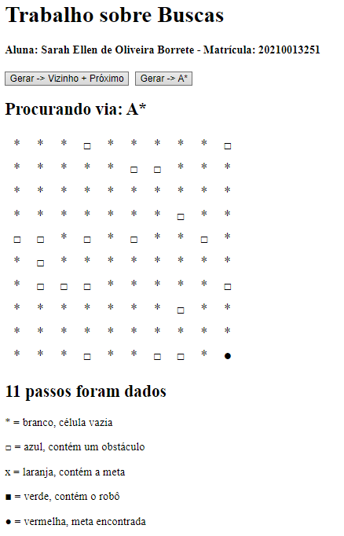

# TrabalhoBuscasIA
Trabalho sobre algoritmos de buscas da disciplina IC817 - Inteligência Artificial, de 2023.1, com a professora Gizelle.

O algoritmo foi feito em Javascript e pode ser acessado e rodado via navegador [aqui](https://tartaponei.github.io/TrabalhoBuscasIA/).

